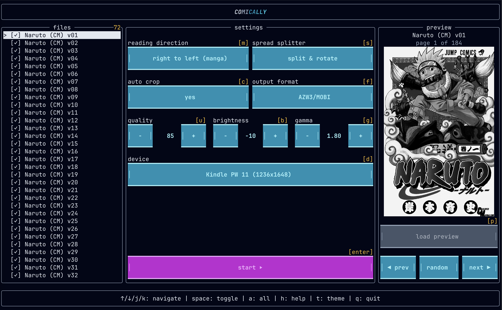

# comically

comically fast manga & comic optimizer for e-readers



## what's this?

tired of manga looking terrible on your kindle? waiting forever for conversions?

comically is a blazing fast manga & comic optimizer built specifically for e-ink displays. preview pages right in your terminal, tweak the settings, then convert entire series in minutes, not hours.

**features:**
- live image previews in your terminal
- batch process entire series
- smart page splitting for double spreads
- auto contrast for e-ink displays
- resizes to your exact screen (no wasted pixels = faster loads)
- way smaller files without quality loss (more comics on device)
- terminal UI with mouse support

**actually fast:**
> tested with spread splitting & rotation enabled on kindle pw 11 (1236x1648)

| series | volumes | pages | size | epub | awz3/mobi |
|--------|---------|-------|------|------|-----------|
| dorohedoro | 23 | 4,647 | 2.5gb | 45s (103 page/s) | 1m 45s (44 page/s) |
| alice in borderland | 9 | 3,064 | 4.5gb | 55s (56 page/s) | 1m 17s (40 page/s) |
| naruto | 72 | 12,849 | 17.5gb | 4m (54 page/s) | 5m 34s (38 page/s) |

> for comparison: [kindle comic converter](https://github.com/ciromattia/kcc) takes 8+ minutes for alice in borderland and 29 minutes for naruto (5-6x slower) 

## prerequisites

#### terminal
requires a terminal with: sixel or kitty graphics protocol (for image previews)

- **works great with:**
  - [ghostty](https://ghostty.org)
  - [wezterm](https://wezfurlong.org/wezterm/)
  - [kitty](https://sw.kovidgoyal.net/kitty/)
  - [iterm2](https://iterm2.com/)
  - [foot](https://codeberg.org/dnkl/foot)
  - [konsole](https://konsole.kde.org/)

- **limited support :** (no image previews)
  - macOS terminal
  - [alacritty](https://alacritty.org/)
  - windows terminal 

#### rust
see https://www.rust-lang.org/tools/install

#### kindlegen (for awz3/mobi output)
on windows and macos, install [kindle previewer 3](https://www.amazon.com/Kindle-Previewer/b?ie=UTF8&node=21381691011). kindlegen is automatically included.

## installation

```bash
cargo install comically
```

## usage

```bash
comically [directory] [--output path]
```

defaults to current directory if no path provided. output defaults to `{directory}/comically/`.

### supported devices

**kindle** - paperwhite 11/12, oasis, scribe, basic  
**kobo** - clara hd/2e, libra 2, sage, elipsa  
**remarkable** - 2  
**other** - ipad mini/pro, onyx boox, pocketbook era

### output formats

- **awz3/mobi** - amazon kindle format (REQUIRES KINDLEGEN)
- **epub** - universal e-reader format
- **cbz** - comic book archive (processed/optimized)

---

*inspired by the excellent work of [Kindle Comic Converter](https://github.com/ciromattia/kcc)*
