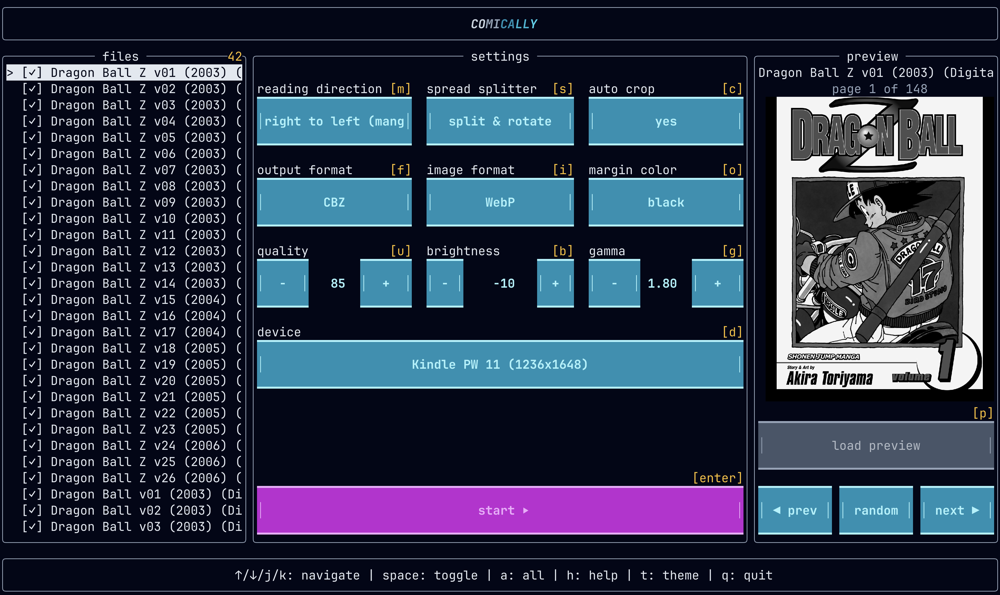

# comically

comically fast manga/comic optimizer for e-readers


## what's this?

tired of manga looking terrible on your kindle? waiting forever for conversions?

comically optimizes manga/comics specifically for e-ink displays. live preview in the terminal shows exactly how it'll look on your device.



**built for e-ink:**
- deep blacks and proper contrast (not washed out lcd optimization)
- perfectly sized for your device (clipping excess margin, smaller files)
- tiny files that load instantly 

**actually fast:**
> with spread splitting and rotating enabled
> kindle PW 11 1236x1648
- 23 volumes of dorohedoro (4647 pages, 2.5gb) 
   - to epub → 45 seconds
   - to awz3/mobi → 105 seconds
- 9 volumes of Alice in Borderland (3064 pages, 4.5gb)
   - to epub → 55 seconds
   - to awz3/mobi → 77 seconds
- 72 volumes of Naruto (12849 pages, 17.5gb)
   - to epub → 240 seconds
   - to awz3/mobi → 334 seconds

**features:**
- see image previews in your terminal while you tweak settings
- batch process entire series
- smart page splitting for double spreads
- auto contrast 
- remembers your settings for next time

## prerequisites

#### rust
see https://www.rust-lang.org/tools/install

#### kindlegen (for awz3/mobi output)
on windows and macos, install [kindle previewer 3](https://www.amazon.com/Kindle-Previewer/b?ie=UTF8&node=21381691011). kindlegen is automatically included.

## installation

```bash
cargo install comically
```

## usage

```bash
comically [directory] [--output path]
```

defaults to current directory if no path provided. output defaults to `{directory}/comically/`.

### supported devices

kindle - paperwhite 11/12, oasis, scribe, basic  
kobo - clara hd/2e, libra 2, sage, elipsa  
remarkable - 2, ipad mini/pro, onyx boox, pocketbook era

### output formats

- **awz3/mobi** - amazon kindle format (REQUIRES KINDLEGEN)
- **epub** - universal e-reader format
- **cbz** - comic book archive (processed/optimized)

